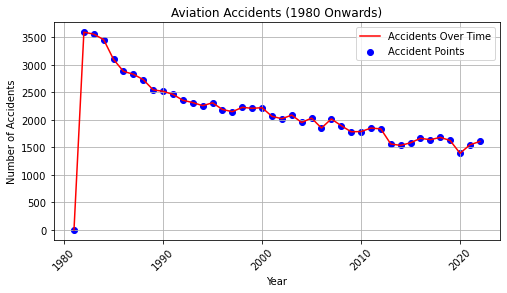
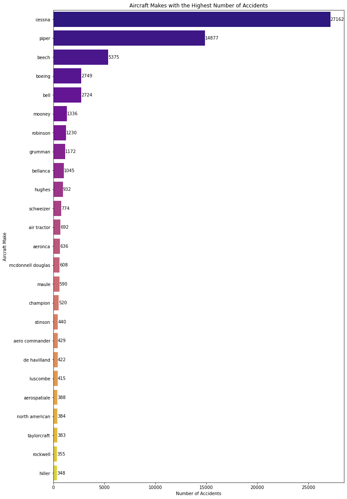
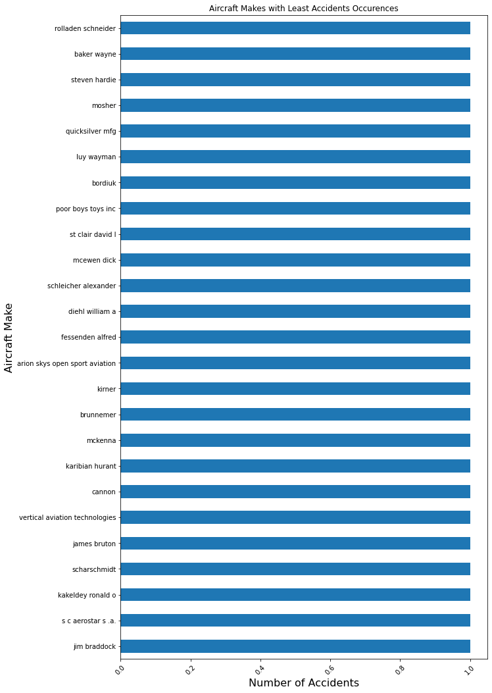
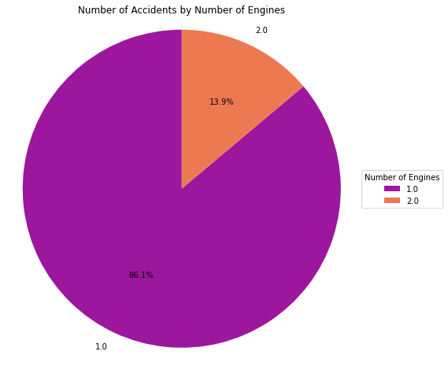
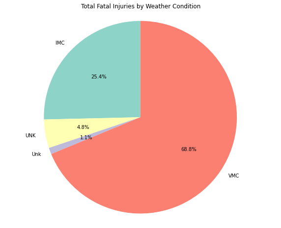

# Comprehensive Aircraft Risk Assessment for Startup Business Operations

## Description
This project aims to conduct a comprehensive analysis of various aircraft models to identify those with the lowest risks, thus facilitating a strategic entry into the aviation industry. As the company diversifies its business portfolio by acquiring aircraft for both commercial and private operations, it is critical to ensure that these investments are sound and minimize potential risks.

By leveraging data-driven insights, the project seeks to evaluate the probable risks associated with different aircraft models and make informed recommendations for acquisition. This analysis will ultimately support better decision-making, enhance operational efficiency, ensure regulatory compliance, and improve customer satisfaction.

## Problem Statement
The company is venturing into the aviation sector with little prior experience, presenting challenges that require thorough risk assessment. Identifying low-risk aircraft is essential to ensure financial stability and operational success as the business expands.

## Goals
Identify the safest aircraft models for acquisition.
Provide business recommendations based on findings.

## Objectives
Identify the lowest-risk aircraft to be purchased by the company.
Minimize potential financial losses and ensure profitability.

## Limitations
The company is relatively new to the aviation sector and lacks in-depth knowledge about market navigation and low-risk aircraft models.

### Data Source
The dataset utilized for this analysis was gathered from Kaggle, originating from the National Transportation Safety Board (NTSB) aviation accident database. This database has documented civil aviation accidents and selected incidents in the United States since 1962. It provides preliminary reports of accidents, which are updated as investigations progress. The goal of this dataset is to enhance the quality and safety of air travel through incident analysis.

### Data Overview
In this project, we will apply our analytical skills to identify the safest aircraft options for the company's expansion into the aviation sector. We will analyze the aviation_data.csv dataset, sourced from the National Transportation Safety Board, which contains aviation accident records spanning from 1962 to 2023.

Shape: The dataset contains 88,889 entries and 30 columns.
Data Types: The data types listed represent the structure of the dataset related to aviation accidents. Each row corresponds to an individual accident, and the columns capture various attributes of these incidents.

i)object: Indicates categorical or string data, such as accident details

ii) float64: Represents numerical values with decimal points, often used for continuous data'

### Import the Relevant Libraries and read the data
`python
import pandas as pd
import numpy as np
import matplotlib.pyplot as plt
import seaborn as sns
%matplotlib inline
df= pd.read_csv('aviation_data.csv',index_col=0,encoding='ISO-8859-1',low_memory=False)
df.head()
`

### Data Cleaning
#### dropping data that has too many missing values preferably more than 40%
`python
dropped_columns=[]
for x in df:
    if (df[x].isna().sum() / len(df[x])) * 100 > 40:
        dropped_columns.append(x)
dropped_columns`

#### Handling missing data
`python
df['Total.Fatal.Injuries'].fillna(df['Total.Fatal.Injuries'].median(),inplace=True)
df['Total.Minor.Injuries'].fillna(df['Total.Minor.Injuries'].median(),inplace=True)
df['Total.Serious.Injuries'].fillna(df['Total.Serious.Injuries'].median(),inplace=True)
df['Total.Uninjured'].fillna(df['Total.Uninjured'].median(),inplace=True)
df['Number.of.Engines'].fillna(df['Number.of.Engines'].mode(),inplace=True)`
#### Filling misssing values
`df=df.fillna(method='ffill').fillna(method='bfill')`

## Graphical Representation
### Trend of Accidents over the years

Overall, there's a clear downward trend. This means that there were fewer accidents over time which shows that flying has become safer compared to past years

### Accident counts in relation to the make

The graph above illustrates the top aircraft makes with the most accidents per year, with the Cessna make having the highest accident count.

The graph shows multiple alternative aircraft makes that have less accidents

### Number of Accidents in relation to the number of engines

Aircrafts with 2 engines have the least amount of accidents compared to those with a single engine.It is therefore a lower risk to have  aircrafts with more engines
#### Number of Accidents as Per Weather Conditions

In aviation, more accidents occur under Visual Meteorological Conditions (VMC), where pilots rely on visual references, compared to Instrument Meteorological Conditions (IMC), where they follow instrument-based rules. This suggests that accidents increase when visibility is good and pilots aren't using instruments, while stricter instrument usage in poor weather reduces accidents.

## Conclusion
The Cessna aircraft model is notorious for being involved in a significant number of aviation accidents, indicating a concerning safety record.

## Recommendations

